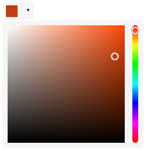
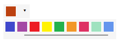
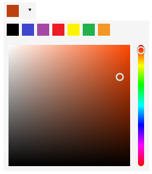

# react-color-chooser

## A color picker component for React


### Usage ###

#### Installation ####

```sh
npm install react-color-chooser
```

#### Sample ####

```typescript
import { ColorChooser } from "react-color-chooser";

function App() {
  const [color, setColor] = useState("#a349a4");

  return (
    <ColorChooser
      selectedColor={color}
      onColorSelected={setColor}
      mode={{
        predefinedColors: [
          "#000000",
          "#3f48cc",
          "#a349a4",
          "#ed1c24",
          "#fff200",
          "#22b14c",
          "#f29727",
        ],
        allowCustomColors: true,
      }}
    ></ColorChooser>
  );
}
```

#### Props ####

`selectedColor` - currently selected color\
`onColorSelected` - a callback called every time the selected color changes\
`mode` - color selection mode: predefined colors, custom colors or both\
`onClose` - a callback called when the picker modal is closed\
`portalRootId` - id of portal root element; if not specified body element is used\
`className` - class name of the main picker container


### Modes ###

#### Custom colors only ####



#### Predefined colors only ####



#### Both predefined and custom colors ####

